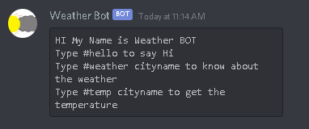

# WeatherBot

This is a weather forcast discord bot which gives information about the current wheather or current temperature of a city. This bot was made using discord.py and OpenWeather API.

You can add this bot to here Discord Server by Clicking <a href="https://discord.com/oauth2/authorize?client_id=799485174269739038&permissions=515136&scope=bot"> over here </a>
<center>
    
</center>
<h3> Commands: </h3>

```
#help - List of All the Commands
```


```
#hello - Greets the User
```


```
#temp cityname - Returns the RealTime Temperature of that city.
```


```
#weather cityname - Returns the weather of the city.
```


You can add this bot to here Discord Server by Clicking <a href="https://discord.com/oauth2/authorize?client_id=799485174269739038&permissions=515136&scope=bot"> over here </a>

